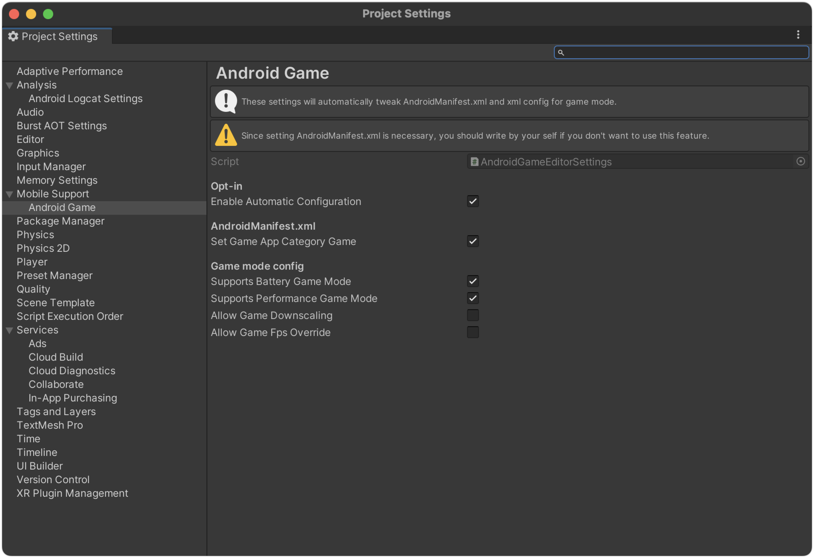

# Unity Mobile Support - AndroidGame <!-- omit in toc -->

[](LICENSE)
[](https://github.com/CyberAgentGameEntertainment/UnityMobileSupport/pulls)
[](#Requirements)

This is small library to support
[Android GameMode and GameState APIs](https://developer.android.com/games/gamemode/gamemode-api)
in Unity older than 2023.1.
Unity 2023.1 or higher has
[built-in support](https://docs.unity3d.com/2023.1/Documentation/ScriptReference/Android.AndroidGame.html)
for Android GameMode and GameState APIs.
Interface of this library is same as Unity's one, you can easily migrate.

## Table of Contents <!-- omit in toc -->

<details>
<summary>Details</summary>

- [Usage](#usage)
  - [Sample](#sample)
- [Setup](#setup)
  - [Requirements](#requirements)
  - [Install](#install)
- [Licenses](#licenses)

</details>

## Usage

1. Configuration of AndroidManifest.xml described in [here](https://developer.android.com/games/gamemode/gamemode-api#setup) is automatically done by this library when building app.
    - You can configure finely via `Mobile Support > Android Game` inside `Project Settings` window.
2. Call `MobileSupport.AndroidGame.GameMode` inside `OnApplicationPause` to get current game mode.
3. You can call `MobileSupport.AndroidGame.SetGameState` to tell the system what state your game is in.



### Sample

```C#
private void OnApplicationPause(bool pauseStatus)
{
    if (pauseStatus) return;

    // switch game quality based on game mode when application resumed
    Debug.Log($"AndroidGame.GameMode={AndroidGame.GameMode}");
}
```

## Setup

### Requirements

This library is compatible with the following environments.

- Unity 2020.3 or higher
- Android targetSdkVersion 33 or higher

### Install

To install the software, follow the steps below.

1. Open the Package Manager from `Window > Package Manager`
2. `"+" button > Add package from git URL`
3. Enter the following
    * https://github.com/CyberAgentGameEntertainment/UnityMobileSupport.git?path=/Packages/MobileSupportAndroidGame

<p align="center">
  
</p>

Or, open `Packages/manifest.json` and add the following to the dependencies block.

```json
{
    "dependencies": {
        "jp.co.cyberagent.unity-mobile-support-android-game": "https://github.com/CyberAgentGameEntertainment/UnityMobileSupport.git?path=/Packages/MobileSupportAndroidGame"
    }
}
```

If you want to set the target version, write as follows.

- https://github.com/CyberAgentGameEntertainment/UnityMobileSupport.git?path=/Packages/MobileSupportAndroidGame#androidgame/1.0.0

To update the version, rewrite the version as described above.
If you don't want to specify a version, you can also update the version by editing the hash of this library in the
package-lock.json file.

```json
{
  "dependencies": {
      "jp.co.cyberagent.unity-mobile-support-android-game": {
      "version": "https://github.com/CyberAgentGameEntertainment/UnityMobileSupport.git?path=/Packages/MobileSupportAndroidGame",
      "depth": 0,
      "source": "git",
      "dependencies": {},
      "hash": "..."
    }
  }
}
```

## Licenses

This software is released under the MIT license.
You are free to use it within the scope of the license, but the following copyright and license notices are required.

* [LICENSE](LICENSE)
